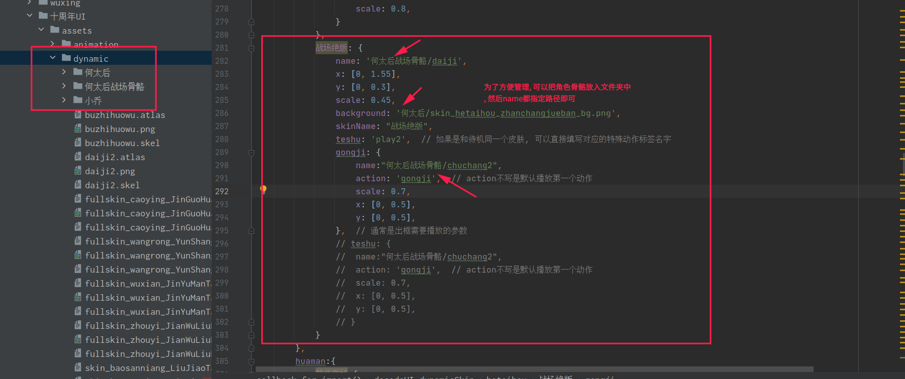
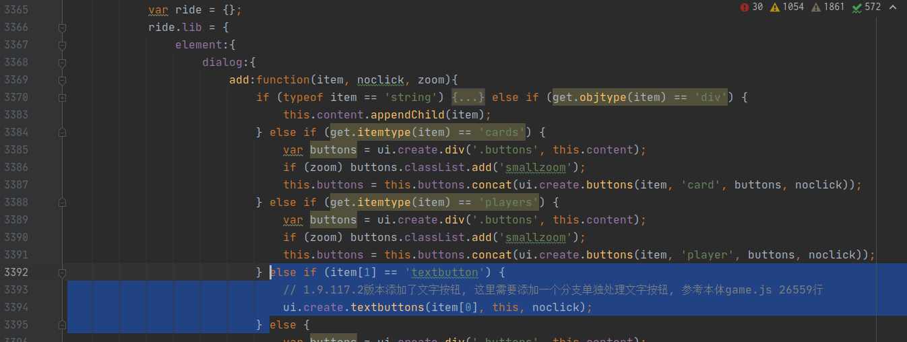
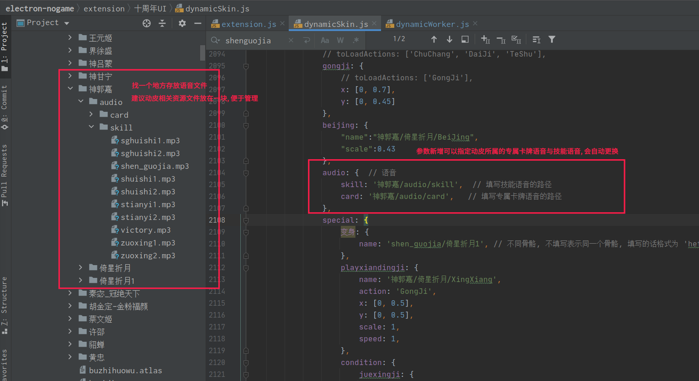
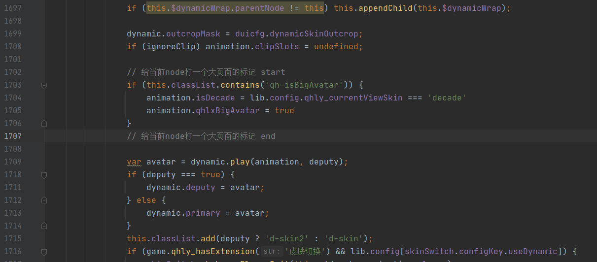

### 皮肤切换使用文档.

#### **说明**

介绍使用文档之前先说明几个问题.

1.  当前扩展只依赖十周年UI, 当前扩展理论上不会和修改UI类的其他扩展发生冲突, 只会和依赖于十周年UI的`dynamicWorker.js`

   文件这些操作动皮的扩展发生冲突.

2. 当前这个扩展是把K佬的`EngEX`插件的动皮部分功能抽离进行魔改. 因此要是用原有的Eng, 只能先把eng动皮相关的功能关闭

3. 原本取这个扩展的名字为<<`皮肤切换`>>的原因是因为个人想做个动皮静皮切换的功能, 

但是最近(2022-12-1)了解到雷佬已经基于千幻聆音实现了这个功能, 基于不重复造轮子

的思想, 我就不做这个东西了. 

4. 如果导入本扩展导致崩溃报错想要还原, 只要还原十周年UI备份的2个改动文件, 然后删除本扩展即可. 
4. 真动皮攻击音效问题, 可以放到本扩展下的audio/effect目录或者和骨骼同一级目录, 音效名字与待机皮肤相同即可. 

#### 扩展功能

​	**1. 可视化调整参数**

​	这个扩展当前的功能是能够在游戏中可视化调整动皮的出框和待机参数, 并且保存调整后的参数,

参数的信息保存在插件同级目录的`saveSkinParams.js`, 这里面保存的参数会在加载当前扩展

读取,并覆盖原来十周年UI中`dynamicSkin.js`填写的动皮位置相关参数, 从而实现保存参数的功能. 

如果想要永久修改可以把本地保存的相关参数copy到原来`dynamicSkin.js`. 


如上图所示, 首先打开编辑动皮参数弹窗. 功能分成两栏, 左边为调整动皮待机的参数, 右边为调整动皮出框的参数.

每次要调整对应的参数需要先点击播放待机或者播放出框按钮. 然后下面的修改参数才会生效. 

十周年UI动皮的典型参数如下所示

```js
		武将名:{
			皮肤名:{
				name: "xxx",	//	必★填	骨骼名称，一般是yyy.skel，注意xxx不带后缀名.skel；
				action: "xxx",	//	可删掉	播放动作，xxx 一般是 DaiJi，目前手杀的骨骼文件需要填；
				x: [10, 0.5],	//	可删掉	[10, 0.5]相当于 left: calc(10px + 50%)，不填默认为[0, 0.5]；
				y: [10, 0.5],	//	可删掉	[10, 0.5]相当于 bottom: calc(10px + 50%)，不填默认为[0, 0.5]；
				scale: 0.5,		//	可删掉	缩放大小，不填默认为1；
				angle: 0,		//	可删掉	旋转角度，不填默认为0；
				speed: 1,		//	可删掉	播放速度，不填默认为1；
				hideSlots: ['隐藏的部件'],	// 隐藏不需要的部件，想知道具体部件名称请使用SpineAltasSplit工具查看
				clipSlots: ['裁剪的部件'],	// 剪掉超出头的部件，仅针对露头动皮，其他勿用
				background: "xxx.jpg",	//	可删掉	背景图片，注意后面要写后缀名，如.jpg .png等 
			}
		},
```

当前插件支持修改其中的`x`,`y`,`scale`,`angle`4个参数, 其中出框参数不支持修改角度`angle`, 这两个的实时参数都在调整弹窗有所显示.

点击调整待机或者调整出框会在左侧出现调整位置的十字键, 这是修改上面动皮参数x,y[0, 0.5]右边的比例参数, 弹窗里的x和y的修改是修改x,y[0, 0.5]左边的0px, 这个相当于微调. 参数调整完成点击保存, 保存成功会弹出保存成功的提示.  

**2. 预览spine动画**

如果开启了加入顶部菜单, 可以简单预览一些spine动画, 在这里可以快速查看骨骼的标签, 这个功能是从spine官方的示例demo扒来的,可以查看spine官方库的示例: https://github.com/EsotericSoftware/spine-runtimes/blob/3.8/spine-ts/webgl/example/index.html

上面也有官方更多的spine使用示例. 


要预览这些骨骼只需要把骨骼文件放到扩展目录下的asset文件夹下即可. 可以使用json或者skel格式, 当然骨骼的版本需要无名杀的spine库支持. 

2023-2-9添加

支持预览spine3.6, spine3.8, spine4.0的骨骼. 分别放入扩展同目录的具体文件夹内即可. 

新增加骨骼自带皮肤的预览.

**3. 支持手杀和十周年动皮出框**

要实现上面这种方式, 需要把`dynamicSkin`参数填写正确. 填写示例如下所示. 示例均以何太后为例, 这个角色有假动皮, 手杀真动和十周年真动特效.  可以完整的演示扩展当前支持的出框功能.

参数说明之前一些其他说的. 为了方便管理, 可以在十周年动态骨骼文件夹创建其他文件夹的, 只需要name参数加上完整的文件夹名字就行.



**参数填写详细说明**

**参数增加功能**

12-06添加

现在当攻击时, 当对应的动皮骨骼有多个动作标签时, 可以选择填写多个标签, 攻击时会随机播放一个攻击动画

25.5.14

添加前景、光污染、技能变身换肤
删除藏珍阁

写法示例: 

```js
caoying:{
    锋芒毕露: {
        name: 'skin_caoying_FengMangBiLou',
        x: [0, 0.3],
        y: [0, -0.13],
        scale: 0.65,
        pos: {
            x: [0,0.7],
            y: [0,0.45]
        },
        gongji: {
            action: ['TeShu', 'GongJi'] // 可以直接指定原来的特殊动作当作另一个攻击动画, 随机从这两个抽取播放
        },
        background: 'skin_caoying_FengMangBiLou_bg.png',
    }
}
```

12-10添加

十周年真动皮典型参数示例

```js
			'评世雕龙': {
				name: '许邵/评世雕龙/daiji',
				x: [0, 0.5],
				y: [0, 0.5],
				teshu: 'play2',  // 触发非攻击技能时播放, (可以改成出框, 默认是原地附近出框, 可能会和其他角色的出框重叠.)
				gongji: {
                    // 攻击位置参数可以不填写, 默认原地出框
					name: '许邵/评世雕龙/chuchang2',
					action: ['gongji', 'jineng']  // 出杀或攻击时随机播放一个动画
				},
				shizhounian: true,  // 标明这是十周年的骨骼, 出场位置和出框默认会在原地, 并且返回也不是位移
				chuchang: {  // 第一回合出场
                    // 攻击参数不用填写
					name: '许邵/评世雕龙/chuchang',
					action: 'play',
					scale: 0.45
				},
				shan: 'play2', // 只有是shizhounian为true时才会播放出闪的动画. 默认play3
				background: '许邵/评世雕龙/skin_Decennial_XuShao_PingShiDiaoLong_bg.png',
                play2: 'play2' // 十周年真动皮会随机播放play2动作, 例如何太后的战场绝版会随机时间播放倒酒动画
			}
```

2023-1-29添加

十周年真动皮有的还有指示线, 可以添加指示线, 参数示例

```js
lvlingqi: {
			'战场绝版': {
				name: '吕玲绮/战场绝版/daiji2',  // 可以直接文件夹带名字
				x: [0, 0.5],
				y: [0, 0.5],
				scale: 1,
				gongji: {
					name: '吕玲绮/战场绝版/chuchang2',
					scale: 0.7,
					action: ['gongji', 'jineng'],  // 现在可以直接填写多个攻击标签, 这样会随机使用一个攻击动作播放
				},
				teshu: 'play2',  // 特殊标签刚刚写错了
				beijing: {
					name: '吕玲绮/战场绝版/beijing',
					scale: 0.4,
					x: [0, 1.2],
					y: [0, 0.5]
				},
				chuchang: {
					name: '吕玲绮/战场绝版/chuchang',
					scale: 0.8,
					action: 'play'
				},
				shizhounian: true,
				// 十周年指示线特效包括shouji和shouji2
				zhishixian: {
					name: '吕玲绮/战场绝版/shouji2',  // 指示线
					scale: 0.8,
					speed: 0.5,
					delay: 0.5,  // 指示线在骨骼攻击多久后出现, 区间[0, 1], 默认0
					effect: {  // 爆炸特效 一般是shouji
						name: '吕玲绮/战场绝版/shouji',  // 指示线
						scale: 0.6,
						speed: 0.7,
						delay: 0.2,  // 在指示线播放多久之后播放爆炸骨骼特效, [0, 0.1]
					}
				}
			}
		},

```

2023-1-31添加

添加json骨骼支持, 如果使用到的骨骼是json,都需要指定json字段为true. 如果出框骨骼和待机骨骼不一样,同样需要指定json为true

```js
'测试json': {
				name: 'test_json/spine_update_renwu',  // 可以直接文件夹带名字
				x: [0, 0.5],
				y: [0, 0.5],
				scale: 1,
				json: true  // 标明当前是json骨骼, 同理如果包含其他骨骼, 都需要指定json字段
			},
```

支持alpha预乘骨骼, 狗卡的骨骼都是不需要alpha预乘的, 如果需要添加其他游戏的spine骨骼, 可能需要alpha预乘功能. 

**注意,  alpha预乘在待机处填写后, 如果包含其他骨骼, 其他骨骼都会默认需要alpha预乘, 如果不需要, 需要显示指定为false**

```js
'测试alpha': {
				name: 'test_alpha/i_agnes_skeleton',  // 可以直接文件夹带名字
				x: [0, 0.5],
				y: [0, 0.5],
				scale: 0.3,
				action: 'idle',
				teshu: 'idle_touch_1',
				gongji: {
					action: 'cutin',
					x: [0, 0.8],
					y: [0, 0.4],
					showTime: 2
                    // alpha: false, 如果出框骨骼不一致且不需要预乘, 需要显示指定false
				},
				alpha: true, // 标明当前骨骼是需要alpha预乘
			}
```

2023-2-9添加 支持多版本spine骨骼当作待机和出框皮肤

```js
test3_8: {
				name: "滕公主/test3_8/spine_minister_57",
				x: [0, 0.63],
				y: [0, -0.43],
				scale: 0.5,
				angle: 0,
				speed: 1,
				version: '3.8',  // 添加上version参数即可. 
				json: true,
			},
```

指示线修改. 添加一个参数调控参数, 这个是为了兼容自己制作的指示线. 可以从攻击点开始计算出发, 十周年的指示线可以不填写这个参数,  一般数字填的很小. 

```js
		zhishixian: {
					name: '神甘宁/ceshi/shouji2',
					scale: 0.35,
					speed: 0.6,
					delay: 0.1,
					factor: 100,  // 调节参数, 自己根据游戏效果进行调节的参数
				}
```

2023-02-11修改

1. 增加动皮可以不出框选择,  在gongji的代码块添加ck: false   即可指定对应的动皮不出框进行攻击. 这是为了适配某些动皮其他动作和待机变化非常小, 甚至可能没有下半身. 所以只是原地切换动作. 

```
gongji: {
					action: 'kaishi',
					skin: 'effect',  
					ck: false,  // 出框与否, 表示攻击不出框,只改变骨骼原本位置. 拼音chukuang缩写
				},
```

2. 添加待机可以指定骨骼皮肤.  攻击如需使用皮肤也要指定对应的皮肤标签, 皮肤的具体标签可以通过spine预览功能获取

```js

	test_skin_gongji: {
				name: '3.8/06/spine_minister_costume_62_88',  // 可以直接文件夹带名字
				x: [0, 0.5],
				y: [0, 0.5],
				scale: 1,
				version: '3.8',
				skin: 'effect',  // 待机初始皮肤
				gongji: {
					action: 'kaishi',
					skin: 'effect',
					ck: false,  // 出框与否, 表示攻击不出框,只改变骨骼原本位置. 拼音chukuang缩写
				},
				json: true,  // 标明当前是json骨骼, 同理如果包含其他骨骼, 都需要指定json字段
				
			},
```

3. 指示线修改: 如果动皮没有攻击动作, 但是也可以配置指示线, 这时候指示线的攻击位置是从角色框出发.  同理主动指定不出框的动皮也可以这样指定.


4. 增加长按可以更换待机骨骼的皮肤. 如果有多个皮肤的话. 

   

2023-02-13修改:

增加允许播放其他spine版本的特效, 接口与老的一致. 使用之前需要打开对应的功能.

```js
// 老的调用方式
decadeUI.animation.playSpine('effect_youxikaishi')

// 播放冰杀, 使用这个函数不用提前加在骨骼.  骨骼特效路径为十周年UI/assets/animation为起点. 放在其他目录请使用相对路径
decadeUI.animation.loadAndPlaySpine({name: 'ol冰杀/bingsha01', json: true}, {parent: game.players[2]}, '4.0')
```

2023-3-20增加

```js
1. 添加teshu触发白名单参数, 只有在白名单内的技能才允许触发teshu(出框或者框内)
2. 指示线增加两种起始位置指定, 可以固定起始位置, 配合某些ol的技能特效.  或者指定从攻击方的角色牌出发
3. 十周年角色的出场位置可以定义了,但是只允许定义玩家的位置

具体写法, 看下面完整参数
指示线增加参数:
// startPos: 'attack',  // 默认, 第一种, 如果是出框则是从骨骼的攻击点出发. 不填写就是原来默认的出框规则
// startPos: 'player',  // 第二种, 从攻击者的角色框位置出发
startPos: {
    x: [0, 0.5],
    y: [0, 0.2],   // 第三种, 手动固定位置为指示线起点
}

特殊白名单参数
whitelist: ['tongli']

出场位置:
chuchang: { 
    name: "张璇/双姝绰约/chuchang",
    action: "play",
    scale: 0.45,
    x: [0, 0.3],  // 设置玩家出场位置, 每个ai位置不同, 所以不设置ai位置
    y: [0, 0.4]
}

```


#### 皮肤切换完整动皮参数

```js
tenggongzhu: {
			菡萏慕卿: {
				name: "滕公主/菡萏慕卿/daiji2",  // 待机同原来一样, 此处表示骨骼文件所在路径. 相对于原来十周年UI的动皮存放位置
				flipX: true,
				x: [0, 0.5],
				y: [0, 0.4],
				scale: 1.0,
				angle: 0,
				speed: 1,
                // json: true,  // 如果当前是json骨骼的话, 也必须要进行标明
                // version: 4.0  // 当前支持spine的版本为3.6, 3.8,4.0. 默认不填写为3.6, 使用其他版本必须标注版本, 否则会报错.
                // atkFlipX  如果有些动皮需要攻击翻转的话, 加上这个参数 当在屏幕左边 会自动翻转.
                    
				teshu: 'play2',// 触发武将技能, 会执行次标签指定动作, 如果不填写默认为Teshu
                teshu: {  // 如果teshu写法是一个对象字典的话, 可以具体配置
					name: '许邵/评世雕龙/chuchang2', // 如果名称与待机一样, 那么不会出框, 否则会出框, 并且只有标记为shizhounian的才能够在回合外进行出框
					action: ['gongji', 'jineng'],  // 播放特殊动画指定的标签, 如果填写了多个, 那么会随机播放一个teshu标签
                    whitelist: ['tongli'], // 触发特殊时候的白名单技能, 例如,此处只有同礼才允许出框.
					// scale: 0.45  // 其他参数同待机. 
				},
				gongji: {  // 攻击参数和teshu一样
					name: "滕公主/菡萏慕卿/chuchang2", 
					action: ["gongji"],  // 出杀或攻击时随机播放一个动画
					scale: 0.45,
					flipX: true,
                    // ck: false,  // 出框与否, 表示攻击不出框,只改变骨骼原本位置. 拼音chukuang缩写, 此处也必须要求和原来的骨骼名称一致,才会有效. 不同骨骼此参数无效. 
				},
				// 新增：配置特殊动作和攻击动作的专属音效
				gongjiAudio: "attack", // 指定攻击动作(GongJi)的专属音效文件名，不含扩展名，会自动寻找对应的mp3文件
				teshuAudio: "skill",   // 指定特殊动作(TeShu)的专属音效文件名，不含扩展名，会自动寻找对应的mp3文件
				// 音效文件优先搜索顺序：
				// 1. extension/十周年UI/assets/dynamic/[指定的音效名]_teshu.mp3 或 [指定的音效名].mp3
				// 2. extension/皮肤切换/audio/effect/[指定的音效名]_teshu.mp3 或 [指定的音效名].mp3
				// 3. 默认角色同名音效文件
				
				shizhounian: true,  // 标明这是十周年的骨骼, 出场位置和出框默认会在原地, 并且返回也不是位移
				chuchang: {  // 每一个回合开始前播放
					name: "滕公主/菡萏慕卿/chuchang",
					action: "play",
					scale: 0.7,
				},
                play2: 'play2',  // 十周年皮肤会随机时间播放play2动作, 默认读取play2标签.
				shan: "play3", // 只有是shizhounian为true时才会播放出闪的动画. 默认play3, 可以不进行填写
				background:  '滕公主/菡萏慕卿/beijing.png',  // 指定角色的静态背景
                    
                // 如果是同骨骼, 并且类似手杀的进场效果, 但是标签不是默认的ChuChang, 可以指定下面这个参数 
                // ss_jinchang: 'Enter',  // 手杀进场效果的标签, 非
                    
                beijing: {  // 角色的动态背景
					name: '滕公主/菡萏慕卿/beijing',  
					scale: 0.4,
					x: [0, 1.2],
					y: [0, 0.5]
				},
				// 指示线
				zhishixian: {
					name: '滕公主/菡萏慕卿/shouji2', // 指示线
					scale: 0.7,
					speed: 0.7,
					delay: 0.1,  // 指示线在攻击多久后出现, 区间[0, 1], 默认0
					factor: 0.5,  // 调节参数, 自己根据游戏效果进行调节的参数
					effect: {  // 爆炸特效 一般是shouji
						name: '滕公主/菡萏慕卿/shouji',  // 爆炸骨骼名称
						scale: 0.6,
						speed: 0.7,
						delay: 0.5,
                        // factor: 100,  // 调节参数, 自己根据游戏效果进行调节的参数, 十周年指示线填小一点. 默认0.5   
					},
                    // startPos: 'attack',  // 默认, 第一种, 如果是出框则是从骨骼的攻击点出发. 不填写就是原来默认的出框规则
					// startPos: 'player',  // 第二种, 从攻击者的角色框位置出发
					startPos: {
						x: [0, 0.5],
						y: [0, 0.2],   // 第三种, 手动指定位置出发
					}
				},
                // 如果动皮包含专属卡牌与专属语音, 定义对应的语音文件
                audio: {  
					skill: '神郭嘉/audio/skill',  // 填写专属技能语音的路径
					card: '神郭嘉/audio/card',   // 填写专属卡牌语音的路径
				},
				skinName: "菡萏慕卿"
			},

```


```js
// 写法1: 假动皮, 和原来一样该怎么写就怎么写
耀紫迷幻: {
    name: 'skin_hetaihou_YaoZiMiHuan',
    x: [0, 0.5],
    y: [0, 0.5],
    scale: 0.8,
    background: 'skin_hetaihou_YaoZiMiHuan_bg.png',
}


// 写法2: 假动皮如果想要出框的话, 也是支持的. 因为假动皮没有攻击动作, 所以就算出框也只是播放待机动作
耀紫迷幻:{
    name: 'skin_hetaihou_YaoZiMiHuan',
    x: [0, 0.5],
    y: [0, 0.5],
    scale: 0.8,
    background: 'skin_hetaihou_YaoZiMiHuan_bg.png',
    gongji: true  // 假动皮只要在原本的基础上就可以触发攻击特效, 就是在屏幕中央显示待机动作
}
// 写法3: 假动皮想要出框也可以详细的设置, 就像下面一样. 可以配置出框后的待机大小位置等参数
耀紫迷幻:{
    name: 'skin_hetaihou_YaoZiMiHuan',
    x: [0, 0.5],
    y: [0, 0.5],
    scale: 0.8,
    background: 'skin_hetaihou_YaoZiMiHuan_bg.png',
    gongji: {
        name: 'skin_hetaihou_YaoZiMiHuan',  // name可以是其他骨骼皮肤, 不填则默认是当前皮肤
        x: [0, 0.5],
        y: [0, 0.5],
        scale: 0.6,
    }
}

// 手杀真动皮: 写法1, 手杀的真动皮的标签都是ChuKuang, DaiJi, TeShu, GongJi
蛇蝎为心:{
    name: 'skin_hetaihou_SheXieWeiXin',
    action: 'DaiJi', // 现在这个可写可不写, 会自动识别手杀真动皮.
    x: [-50, 0.5],
    y: [10, 0.1],
    scale: 0.46,
    angle: 27,
    clipSlots: ['wangzuo', 'bu2', 'bu3'],
    background: 'skin_hetaihou_SheXieWeiXin_bg.png',
    skinName: '蛇蝎为心',
}
// 手杀真动皮: 写法2, 像下面这种写法是原来EngEX的真动皮写法, 保留这种写法兼容原来的EngEX参数写法.
蛇蝎为心:{
    name: 'skin_hetaihou_SheXieWeiXin',
    action: 'DaiJi', // 现在这个可写可不写, 会自动识别手杀真动皮.
    x: [-50, 0.5],
    y: [10, 0.1],
    scale: 0.46,
    angle: 27,
    pos: {  // 通过pos参数调整出框后的位置参数
        x: [0,0.8],
        y: [0,0.4]
    }
    clipSlots: ['wangzuo', 'bu2', 'bu3'],
    background: 'skin_hetaihou_SheXieWeiXin_bg.png',
    skinName: '蛇蝎为心',
}
// 手杀真动皮: 写法3,  不通过pos参加指定, 统一通过gongji参数来配置
蛇蝎为心:{
    name: 'skin_hetaihou_SheXieWeiXin',
    // action: 'DaiJi',
    x: [-50, 0.5],
    y: [10, 0.1],
    scale: 0.46,
    angle: 27,
    clipSlots: ['wangzuo', 'bu2', 'bu3'],
    background: 'skin_hetaihou_SheXieWeiXin_bg.png',
    skinName: '蛇蝎为心',
    gongji: {  // 指定播放出框攻击的位置大小参数. 
        x: [0, 0.5],
        y: [0, 0.5],
        scale: 0.8,
    }
}

// 十周年UI动皮, 由于十周年UI动皮复杂, 动作都没有统一在一个骨骼文件中. 所以通过下面几种的方式绕过
// 下面的参数解释: 外层还是原来的写法, 不写action会默认寻找骨骼的第一个动作标签当作待机动作.

// teshu动作解释----- 特殊动作是指代当角色使用非攻击的技能时会播放特殊动作.
// teshu标签可以指定同一个皮肤的其他动作, 直接指定名字, 不填默认是手杀的"TeShu", 当然也可以指定其他骨骼文件的某个动作, 当指定
// 其他骨骼文件后, 就是出框动作了, 见teshu写法2

// gongji动作解释----- 当角色使用攻击(比如出杀,南蛮)等会自动触发攻击动作, 也就是下面gongji标签所指代的
// gongji同样可以简写待机骨骼的gongji标签名字,或者可以指定其他骨骼的gongji动画. 所以可以指定其他角色的gongji动画, 虽然很奇怪

// teshu写法1
战场绝版: {
    name: '何太后/daiji',  // 为了方便管理, 可以像这种写法, 把同一个角色的骨骼文件放在一个目录下, 不过name和背景需要指定目录
    x: [0, 1.55],
    y: [0, 0.3],
    scale: 0.45,
    background: '何太后/skin_hetaihou_zhanchangjueban_bg.png',
    teshu: 'play2',  // 如果是和待机同一个皮肤, 可以直接填写对应的特殊动作标签名字
}

// teshu写法2
战场绝版: {
    name: '何太后战场骨骼/daiji',
    x: [0, 1.55],
    y: [0, 0.3],
    scale: 0.45,
    background: '何太后/skin_hetaihou_zhanchangjueban_bg.png',
    teshu: {
        name:"何太后战场骨骼/chuchang2",
        action: 'gongji',
        scale: 0.7,
        x: [0, 0.5],
        y: [0, 0.5],
    }
}

// gongji写法1
战场绝版: {
    name: '何太后战场骨骼/daiji',
    x: [0, 1.55],
    y: [0, 0.3],
    scale: 0.45,
    background: '何太后/skin_hetaihou_zhanchangjueban_bg.png',
    gongji: 'play2',  // 这种简写 攻击会自动寻找待机皮肤的play2标签在屏幕中央播放, x,y是[0,0.5],scale同待机
}


// gongji写法2
战场绝版: {
    name: '何太后战场骨骼/daiji',
    x: [0, 1.55],
    y: [0, 0.3],
    scale: 0.45,
    background: '何太后/skin_hetaihou_zhanchangjueban_bg.png',
    gongji: {  // 这种就是详细写法了
        name:"何太后战场骨骼/chuchang2",  // 可以指定另外的骨骼, 包括其他角色, 只要路径写对. 
        action: 'gongji',  // action不写是默认播放第一个动作
        scale: 0.7,
        x: [0, 0.5],
        y: [0, 0.5],
    }
}
```


 **调整千幻雷修手杀大屏预览的动皮位置功能**

调整需要打开功能面板,然后点开大屏开始调整. 最后的效果如下所示, 经过这个细微调整可以做到和手杀的预览界面差不多


#### 十周年文件的修改

**1.9.117.2后十周年UI与本体兼容问题**

本体添加了新的文字按钮, 需要在十周年UI extension.js添加下面几行代码



```js
else if (item[1] == 'textbutton') {
								// 1.9.117.2版本添加了文字按钮, 这里需要添加一个分支单独处理文字按钮, 参考本体game.js 26559行
								ui.create.textbuttons(item[0], this, noclick);
							} 
```

####  变身与播放功能.  

special完整的参数. 一般只需使用一个. 其实transform和play可以都写, 也可以只写其中一个. transform表示变身, play表示播放

```js
special = {
    // 首先需要定义特效的参数, 下面的transform就是定义特效的名字.
    
    // 更换骨骼/皮肤/标签  transform可以只填写自己想要变换的, 比如只填写变换标签或者只变换骨骼skin
    transform: {
        hp: 2,   // 当被低血量使用, 表示当前血量, 当被受伤使用, 表示一次性受到多少伤害触发. 
        name: 'xxxx', // 不同骨骼, 不填写表示同一个骨骼, 填写的话格式为 'hetaihou/战场绝版'  角色名id+皮肤名称
        skin: '',   // 可以切换同一个骨骼的其他皮肤
        action: '', // 也可以切换播放一段骨骼的其他标签
        loop: true, // 如果是true, 表示是切换为同骨骼的其他标签, 如果为false, 只是单纯的触发播放另一个标签. 该参数只有当name一致且action指定才有效
        times: 1,  // 当条件是受伤时表示受到多少次伤害后触发该变身骨骼
    },
    // 播放一段特效, 例如觉醒或击杀可以播放
    play: {
          name: '骨骼位置',  // 路径以dynamic为起点
          x: [0, 0.5],  // x和y不填写默认在屏幕中央.  后面考虑像特效测试一样可以指定其他位置
          y: [0, 0.5],
          scale: 0.5, 
          speed: 0.5, // 还有一些其他参数和待机一致 
    },
    // 触发以上定义的特效的条件, 现阶段有8种, 觉醒技, 低血量, 击杀, 转换技, 受伤次数, 限定技, 使命技, 受伤
    condition: {
        // 觉醒技
        juexingji: {
            transform: 'transform',  // 觉醒后转换的骨骼. 名字是上面预定义的转换名字
            play: 'play',  // 也可以选择播放一段动画, 播放的动画名字, 上面预定义的
        },
        // 低血量, 回血后, 会恢复原来的骨骼
        lowhp: {
            transform: ['transform2', 'transform3'],  // 可以填入多个转换骨骼, 当血量到达设置的阈值时, 切换为对应的骨骼			
            recover: false,  // 恢复血量是否变回原来的, 如果为true, 恢复体力时会恢复到原来的骨骼. 
        	effect: {
                scale: 0.5,  // 播放变换骨骼的参数
                speed: 1.5,
                name: 'huanfu'  // 换肤文件
            }, // 变身播放更换骨骼的特效, 变身特效文件放入 皮肤切换/effects/transform下面, 不填写默认播放曹纯的换肤特效骨骼
        },  
        // 击杀, 配合一些击杀骨骼使用, 在屏幕中央进行播放. 一般只有ol有击杀骨骼 
        jisha: {
            play: 'play1',  // 击杀可以播放一段动画
            transform: 'transform2',  //  
        },
        // 转换技
        zhuanhuanji: {
            play: 'play2',
            transform: 'transformXXX'  // 转换技触发后会与预设的两种骨骼互相切换
        },
        // 受伤次数
        damageTimes: {
            play: 'play2',  // 播放的动画
            transform: ['transformXXX', 'transformYYY']  // 可以设置多个触发条件
        },
        // 限定技
        xiandingji: {
            transform: 'transform1',  
            play: 'play',  // 也可以选择播放一段动画     
        },
        // 使命技能成功
        shimingjiSuccess: {
            transform: 'transform1', 
            play: 'play',  // 也可以选择播放一段动画     
            audio: 'xxx', //
        }
           // 使命技能失败
        shimingjiFail: {
            transform: 'transform1',  
            play: 'play',  // 也可以选择播放一段动画     
            audio: 'xxx', //
        },
    	// 受伤
    	damage: {
            transform: 'transform1',  // 受伤变身一次后, 就不会再次触发, 除非手动更换皮肤
            play: 'play',  // 也可以选择播放一段动画 
            audio: 'xxx', // 受伤播放语音
        }
    }
}
```

**示例**, **曹纯的低血量变身.** 

```js
{
    caochun: {
        变身前: {
				name: "曹纯/变身前/daiji2",
				scale: 0.35,
				x: [0,0.5],
				y: [0,0.5],
				shizhounian: true,
				background: "曹纯/变身前/static_bg.png",
				beijing: {
					name: "曹纯/变身前/beijing",
					scale: 0.35,
					x: [0,0.98],
					y: [0,0.47],
				},
				chuchang: {
					name: "曹纯/变身前/chuchang",
					scale: 0.7,
				},
				gongji: {
					name: "曹纯/变身前/chuchang2",
					scale: 0.35,
				},
				teshu: {
					name: "曹纯/变身前/chuchang2",
					scale: 0.35,
				},
				zhishixian: {
					name: "曹纯/变身前/shouji2",
					scale: 0.7,
					delay: 0.3,
					speed: 0.8,
					effect: {
						name: "曹纯/变身前/shouji",
						scale: 0.7,
						delay: 0.3,
						speed: 0.8,
					},
				},
				special: {
					变身1: {
						hp: 3,  // 如果血量低于3, 则会触发变身效果, 当血量恢复到2以上, 那么
						name: 'caochun/虎年曹纯', // 不同骨骼, 不填写表示同一个骨骼, 填写的话格式为 'hetaihou/战场绝版'  角色名+皮肤名称
					},
					变身2: {
						hp: 2,  // 如果血量低于或等于2, 则会触发变身效果,
						name: 'caochun/变身后', // 不同骨骼, 不填写表示同一个骨骼, 填写的话格式为 'hetaihou/战场绝版'  角色名+皮肤名称
					},
					condition: {
                        // 触发条件选择低血量
						lowhp: {
							transform: ['变身1', '变身2'],  // 设置血量需要变换的骨骼, 允许设置多个
							recover: false,  // 恢复血量是否变回原来的, 如果为true, 回复会回复原来的骨骼
						},
					}
				}
			},
            变身后: {
				name: "曹纯/变身后/daiji2",
				scale: 0.35,
				x: [0,0.5],
				y: [0,0.5],
				shizhounian: true,
				background: "曹纯/变身后/static_bg.png",
				beijing: {
					name: "曹纯/变身后/beijing",
					scale: 0.35,
					x: [0,0.98],
					y: [0,0.47],
				},
				chuchang: {
					name: "曹纯/变身后/chuchang",
					scale: 0.7,
				},
				gongji: {
					name: "曹纯/变身后/chuchang2",
					scale: 0.35,
				},
				teshu: {
					name: "曹纯/变身后/chuchang2",
					scale: 0.35,
				},
				zhishixian: {
					name: "曹纯/变身后/shouji2",
					scale: 0.7,
					delay: 0.3,
					speed: 0.8,
					effect: {
						name: "曹纯/变身后/shouji",
						scale: 0.7,
						delay: 0.3,
						speed: 0.8,
					},
				},
			},  
                
    }
}

```

**觉醒技示例**

```js

special: {
					变身: {
						name: 'caochun/变身前', // 不同骨骼, 不填写表示同一个骨骼, 填写的话格式为 'hetaihou/战场绝版'  角色名+皮肤名称
						// effect: true, // 预留, 选择更换骨骼的特效 , 目前只有曹纯一个, 全部默认播放曹纯的换肤骨骼
					},
                    // 这时定义觉醒时候播放的动画
					juexing: {
						name: '孙策/孙策觉醒/suncehunzi1',
						json: true,
						x: [0, 0.5],
						y: [0, 0.5],
						
						name: '../../../皮肤切换/effects/蔡文姬击杀/JiSha',scale: 0.8,
						speed: 0.8,
						version: '4.0',
						delay: 2,  // 单位秒
					},
					condition: {
						juexingji: {
							transform: "变身",  // 设置觉醒时候需要变换的骨骼
							play: 'juexing',  // 觉醒后可以设置播放的动画
						},
					}
				}
```

**击杀示例**

例如蔡文姬击杀填写参数

```js
special: {
    
					变身: {
						name: 'ol_caiwenji/亚瑟王', // 不同骨骼, 不填写表示同一个骨骼, 填写的话格式为 'hetaihou/战场绝版'  角色名+皮肤名称
						// effect: true, // 预留, 选择更换骨骼的特效 , 目前只有曹纯一个, 全部默认播放曹纯的换肤骨骼
					},
					jisha: {
						name: '../../../皮肤切换/effects/蔡文姬击杀/JiSha',  // 如果放在其他扩展文件夹里参照这个格式,
						json: true,
						x: [0, 0.5],
						y: [0, 0.5],
						scale: 0.6,
						speed: 0.8,
						version: '4.0',
						delay: 2,  // 单位秒, 表示延时多久后进行播放
					},
					condition: {
                        // 触发条件选择击杀
						jisha: {
							transform: "变身",  // 设置需要变换的骨骼
							play: 'jisha',
						},
					}
				}
```

其他转换技,受伤次数等类似, 就不赘述了. 

**变身特效参数**

默认是十周年曹纯的2血变身特效, 可以指定其他变身特效, 变身特效存放在皮肤切换effects/transform目录下, 在变身参数中指定对应的变身特效.如下图所示. 皮肤切换预定义了几种默认的变身特效, 可以只需要指定特效名称即可. 分别是 

`posui`, `jinka`, `qiancheng`, `shaohui`, 可以自己尝试下更换特效看看效果.


#### 技能语音与专属卡牌语音

专属卡牌与专属语音设置参数

```js
{
			倚星折月: {
				name: "神郭嘉/倚星折月/XingXiang",
				x: [0,-0.21],
				y: [0,0.42],
				scale: 0.43,
				gongji: {
					x: [0, 0.7],
					y: [0, 0.45]
				},
				beijing: {
					"name":"神郭嘉/倚星折月/BeiJing",
					"scale":0.43
				},
                // 动皮专属语音指定, 语音相对路径与动皮参数一致
				audio: {  
					skill: '神郭嘉/audio/skill',  // 填写专属技能语音的路径
					card: '神郭嘉/audio/card',   // 填写专属卡牌语音的路径
				},
				special: {
					变身: {
						name: 'shen_guojia/倚星折月1', // 不同骨骼, 不填写表示同一个骨骼, 填写的话格式为 'hetaihou/战场绝版'  角色名+皮肤名称
					},
					playxiandingji: {
						name: '神郭嘉/倚星折月/XingXiang',
						action: 'GongJi',
						x: [0, 0.5],
						y: [0, 0.5],
						scale: 1,
						speed: 1,
					},
					condition: {
						juexingji: {
							transform: "变身",  // 设置血量需要变换的骨骼
							audio: '神郭嘉/audio/victory', // 触发限定技时候播放的语音
						},
						xiandingji: {
							// transform: "变身",  // 设置血量需要变换的骨骼
							// play: 'playxiandingji'
							audio: '神郭嘉/audio/skill/victory', // 触发限定技时候播放的语音
						},
						jisha: {
							audio: '神郭嘉/audio/skill/victory'
						}
					}
				}
			},
			倚星折月1: {
				name: "神郭嘉/倚星折月1/XingXiang_1",
				x: [0,-0.21],
				y: [0,0.42],
				scale: 0.43,
				gongji: {
					"x":[0,0.7],
					"y":[0,0.45]
				},
				beijing: {
					"name":"神郭嘉/倚星折月1/BeiJing_1",
					"scale":0.43
				},
				audio: {  // 语音
					skill: '神郭嘉/audio/skill',  // 填写技能的路径
					card: '神郭嘉/audio/card',   // 填写基本牌的路径
				},
			},
		}
```





#### 播放语音功能

增加播放语音功能. 在之前定义的几种条件下, 除了触发变换骨骼与播放特效外, 还支持播放语音. 以曹纯2血变身为例, 其他觉醒,限定技等写法一致. 

播放特效语音的写法可以有3处, 任意一处均可.  但是优先级以此递减

```js
special: {
					变身1: {
						hp: 3,  // 如果血量低于3, 则会触发变身效果, 当血量恢复到2以上, 那么
						name: 'caochun/虎年曹纯', // 不同骨骼, 不填写表示同一个骨骼, 填写的话格式为 'hetaihou/战场绝版'  角色名+皮肤名称
                        // 第一处, 在有多个变身条件下, 可以单独指定一段语音, 触发改变身效果可以播放, 优先级最高
						//audio: '神郭嘉/audio/skill/victory', // 触发限定技时候播放的语音
						effect: 'shaohui', // 预留, 选择更换骨骼的特效 , 目前只有曹纯一个, 全部默认播放曹纯的换肤骨骼
					},
					变身2: {
						hp: 1,  // 如果血量低于2, 则会触发变身效果, 当血量恢复到2以上, 那么
						name: 'caochun/变身后', // 不同骨骼, 不填写表示同一个骨骼, 填写的话格式为 'hetaihou/战场绝版'  角色名+皮肤名称
                        // 此处的语音可以和变身1不同, 当达成1血后播放的语音
						// audio: '曹纯/audio/XingXiang', // 触发限定技时候播放的语音
					},
					play: {
						name: "曹纯/变身后/chuchang",
						scale: 1,
						x: [0,0.8],
						y: [0,0.4],
						audio: '曹纯/audio/XingXiang', // 第二处位置, 播放动画时,可以同时播放语音文件, 优先级次之
					},
					condition: {
						lowhp: {
                            // 第三处位置, 语音文件定义在此处, 表示只要触发变身, 都会播放对应的语音文件.
                            audio: '曹纯/audio/XingXiang', // 播放动画时,同时播放的语音文件, 优先级最低
							transform: ['变身1', '变身2'],  // 设置血量需要变换的骨骼
							recover: false,  // 恢复血量是否变回原来的,
							play: 'play',
						},
					}
				}
```

**参数说明**


#### 千幻雷修1.75调大屏参数

如果需要使用皮肤切换的调整千幻雷修的十周年和手杀大页的数据话,   需要关闭雷音的调整大页的按钮, 并且需要在雷音ext对应位置添加几行代码.  大致在1702行左右



```js
                // 给当前node打一个大页面的标记 start
                if (this.classList.contains('qh-isBigAvatar')) {
                    animation.isDecade = lib.config.qhly_currentViewSkin === 'decade'
                    animation.qhlxBigAvatar = true
                }
                // 给当前node打一个大页面的标记 end
```

千幻大屏页面打不开出现bug

需要修改函数.  搜索千幻ext函数 game.qhly_deepClone进行替换. 

```js
            game.qhly_deepClone = function (obj, newObj) {
                var newObj = newObj || {};
                for (let key in obj) {
                    // 可能有的参数是null, 防止空指针异常
                    if (obj[key] && obj[key].constructor === Array) {
                        newObj[key] = [...obj[key]];

                    } else if (typeof obj[key] == 'object') {
                        // 检查下是否是循环引用自身, 如果是退出递归, skin参数暂时只会循环引用自身, 其他更复杂的循环引用就不检查了
                        if (obj[key] === obj) {
                            newObj[key] = newObj
                            continue
                        }
                        newObj[key] = {};
                        game.qhly_deepClone(obj[key], newObj[key]);
                    } else {
                        newObj[key] = obj[key]
                    }
                }
                return newObj;
            }
```


